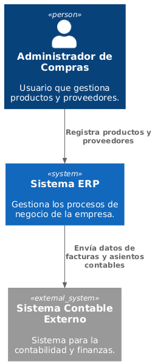

# Alcance y Contexto

El sistema ERP permitirá gestionar los procesos de compras, inventario, facturación y administración de la empresa.

## Diagrama de Contexto

El diagrama muestra los usuarios y sistemas externos que interactúan con el ERP.
