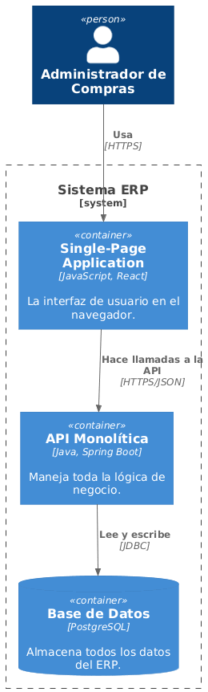

# Vista de Bloques

## Diagrama de Contenedores

### Contenedores

- Aplicación Web: interfaz para los usuarios.
- API ERP: procesa la lógica de negocio.
- Base de Datos PostgreSQL: almacena la información del sistema.
