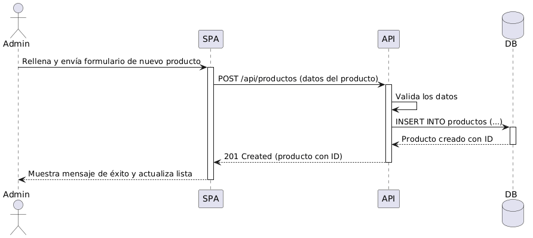

# Vista de Ejecución

## Escenario: Registrar Producto

### Flujo

1. El usuario ingresa los datos del producto.
2. La aplicación envía la solicitud a la API.
3. La API valida la información.
4. La base de datos almacena el producto.
5. El sistema confirma el registro exitoso.
